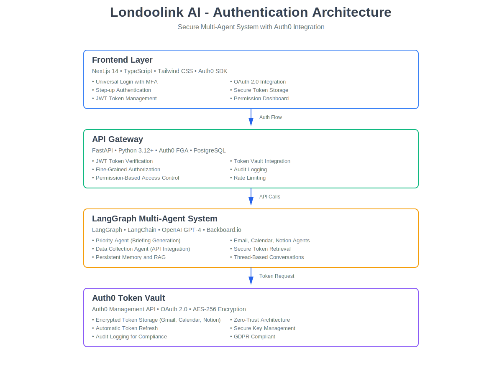

<div align="center">

```
██╗      ██████╗ ███╗   ██╗██████╗  ██████╗  ██████╗ ██╗     ██╗███╗   ██╗██╗  ██╗
██║     ██╔═══██╗████╗  ██║██╔══██╗██╔═══██╗██╔═══██╗██║     ██║████╗  ██║██║ ██╔╝
██║     ██║   ██║██╔██╗ ██║██║  ██║██║   ██║██║   ██║██║     ██║██╔██╗ ██║█████╔╝ 
██║     ██║   ██║██║╚██╗██║██║  ██║██║   ██║██║   ██║██║     ██║██║╚██╗██║██╔═██╗ 
███████╗╚██████╔╝██║ ╚████║██████╔╝╚██████╔╝╚██████╔╝███████╗██║██║ ╚████║██║  ██╗
╚══════╝ ╚═════╝ ╚═╝  ╚═══╝╚═════╝  ╚═════╝  ╚═════╝ ╚══════╝╚═╝╚═╝  ╚═══╝╚═╝  ╚═╝
                                                                              AI
```

### Your Intelligent Digital Twin

[](https://londoolink-ai.vercel.app)
[](https://londoolink-ai.vercel.app/login?demo=true)
[](https://auth0.com)

[](https://fastapi.tiangolo.com)
[](https://nextjs.org)
[](https://langchain-ai.github.io/langgraph)
[](https://auth0.com)
[](https://backboard.io)
[](https://deepmind.google/technologies/gemini)
[](https://londoolink-abc635b5fe07.herokuapp.com)

---

</div>

# Londoolink AI — Your Intelligent Digital Twin

> Built for the **Auth0 AI Agents Hackathon 2026** & **Global Hack Week: API**

Londoolink is a multi-agent AI system with **persistent memory** that acts on your behalf across Gmail, Google Calendar, and Notion — while keeping your credentials locked in **Auth0 Token Vault**. Your agents never hold raw tokens. You stay in control.

**Live Demo:** https://londoolink-ai.vercel.app  
**Backend API:** https://londoolink-abc635b5fe07.herokuapp.com  
**Try Demo Account:** Click "Try Demo" on the login page

---

## The Core Idea

Most AI assistants are passive and forgetful — they wait for you to ask and forget everything after. Londoolink is different:

1. **Proactive Intelligence** — Agents analyze your data and generate daily briefings automatically
2. **Persistent Memory** — Powered by Backboard.io, the AI remembers your preferences across sessions
3. **Secure by Design** — Auth0 Token Vault stores OAuth tokens, Auth0 FGA controls permissions
4. **Context-Aware** — Thread-based conversations maintain context for follow-up questions
5. **Multi-Platform** — Integrates Gmail, Google Calendar, Notion, and more

### How It Works

1. You connect Google and Notion via Auth0 OAuth
2. Auth0 Token Vault securely stores your access tokens (encrypted at rest)
3. LangGraph agents analyze your emails, calendar, and Notion pages
4. Backboard.io stores your preferences and conversation history
5. You get a personalized daily briefing based on your learned preferences
6. Urgent tasks trigger SMS alerts via Africa's Talking

Your agents act on your behalf. Auth0 ensures they only access what you've permitted. Backboard.io ensures they remember what matters to you.

---

## Architecture



```
Frontend (Next.js 14)
    ↓ Auth0 Universal Login + Step-Up Auth
Backend (FastAPI)
    ↓ JWT Verification + Auth0 FGA Authorization
    ↓ Auth0 Token Vault (OAuth token storage)
    ↓ LangGraph Multi-Agent System
        ├── Email Agent (Gmail readonly)
        ├── Calendar Agent (Calendar readonly)
        ├── Notion Agent (read_content)
        └── Priority Agent → SMS Alert (Africa's Talking)
    ↓ Backboard.io (AI Memory & RAG)
    ↓ Neon PostgreSQL (user data, audit logs)
```

### Auth0 Integration
- **Universal Login** — All auth flows through Auth0 (Google OAuth, email/password, MFA)
- **Token Vault** — Google and Notion OAuth tokens stored in Auth0, never in our DB
- **Fine-Grained Authorization (FGA)** — Permission-based access control for sensitive operations
- **Step-Up Authentication** — Re-authentication required for high-security actions
- **M2M Client** — Backend uses client credentials to retrieve tokens from vault
- **MFA** — Multi-factor authentication delegated entirely to Auth0

### Backboard.io Integration
- **Persistent Memory** — AI remembers user preferences across sessions
- **Cloud-Based RAG** — Semantic search for emails, calendar events, and documents
- **Thread Management** — Conversation history for follow-up questions
- **Automatic Learning** — Agents learn from your interactions over time

### LangGraph Agents
- **Email Agent** — Reads Gmail with `gmail.readonly` scope, surfaces urgent messages
- **Calendar Agent** — Reads Google Calendar, flags conflicts and upcoming meetings
- **Notion Agent** — Reads Notion workspace pages for action items
- **Priority Agent** — Synthesizes all agent outputs into a personalized briefing
- **Data Collection Agent** — Orchestrates data gathering from all integrated services

---

## Tech Stack

| Layer | Technology |
|-------|-----------|
| Frontend | Next.js 14, Tailwind CSS, Framer Motion, Zustand |
| Backend | FastAPI, SQLAlchemy, Alembic |
| AI | LangGraph, LangChain, Google Gemini, OpenAI GPT-4 |
| Memory & RAG | Backboard.io (Cloud-based AI Memory) |
| Auth | Auth0 (Universal Login, Token Vault, FGA, Step-Up Auth) |
| Database | Neon PostgreSQL |
| SMS | Africa's Talking |
| Deployment | Vercel (frontend), Heroku (backend) |

---

## Key Features

### 🧠 Persistent AI Memory
- **User Preferences** — AI learns and remembers your priorities across sessions
- **Preference Management** — Add, view, and manage preferences via UI at `/dashboard/preferences`
- **Cross-Session Learning** — Memory persists across application restarts using Backboard.io
- **Personalized Briefings** — Daily briefings tailored to your learned preferences
- **Cloud-Based RAG** — Semantic search for emails, calendar events, and documents

### 🔐 Enterprise-Grade Security
- **Auth0 Token Vault** — OAuth tokens encrypted at rest with AES-256, never in your database
- **Fine-Grained Authorization (FGA)** — Permission-based access control for sensitive operations
- **Step-Up Authentication** — Re-authentication required for high-security actions
- **Audit Logging** — Complete audit trail of all agent actions with compliance support
- **Zero-Trust Architecture** — Secure key management and GDPR compliance

### 💬 Context-Aware Conversations
- **Thread Management** — Conversation history maintained via Backboard.io threads
- **Follow-Up Questions** — Ask questions about your briefings with full context preservation
- **Multi-Turn Dialogue** — Natural conversations with memory of previous exchanges
- **Automatic Context** — Agents remember conversation flow across sessions

### 🤖 Intelligent Multi-Agent System
- **Proactive Analysis** — Agents automatically analyze your data without prompting
- **Priority Detection** — Smart prioritization of tasks and events based on learned preferences
- **SMS Alerts** — Urgent notifications via Africa's Talking for time-sensitive items
- **RAG-Powered Search** — Semantic search across all your documents and communications
- **Multi-Platform Integration** — Gmail, Google Calendar, Notion, and more

---

## Quick Start

### Prerequisites
- Python 3.12+
- Node.js 18+
- Auth0 account
- Neon PostgreSQL database

### Backend
```bash
cd backend
python -m venv .venv
source .venv/bin/activate
pip install -r requirements.txt

cp .env.example .env
# Fill in AUTH0_DOMAIN, AUTH0_CLIENT_ID, AUTH0_CLIENT_SECRET,
# AUTH0_M2M_CLIENT_ID, AUTH0_M2M_CLIENT_SECRET, DATABASE_URL, GEMINI_API_KEY

alembic upgrade head
uvicorn app.main:app --reload --port 8000
```

### Frontend
```bash
cd app-frontend
npm install

# .env.local
NEXT_PUBLIC_API_BASE_URL=http://localhost:8000
NEXT_PUBLIC_AUTH0_DOMAIN=your-tenant.auth0.com
NEXT_PUBLIC_AUTH0_CLIENT_ID=your-client-id
NEXT_PUBLIC_AUTH0_AUDIENCE=http://localhost:8000

npm run dev
```

---

## Key API Endpoints

### Authentication
```
POST /api/v1/auth/google/callback   — Exchange Auth0 code for JWT
POST /api/v1/auth/demo-login        — Demo account login
```

### Agent Operations
```
GET  /api/v1/agent/briefing/daily   — Generate daily AI briefing
GET  /api/v1/agent/briefing/urgent  — Generate urgent briefing
GET  /api/v1/agent/briefing/weekly  — Generate weekly summary
```

### Memory & Preferences
```
POST /api/v1/memory/preferences     — Add user preference
GET  /api/v1/memory/preferences     — Get all preferences
GET  /api/v1/threads                — List conversation threads
GET  /api/v1/threads/{thread_id}    — Get thread history
POST /api/v1/threads/{thread_id}/messages — Add follow-up question
```

### Integrations
```
GET  /api/v1/integrations/status    — Check connected services
POST /api/v1/integrations/google/connect  — Start Google OAuth
POST /api/v1/integrations/notion/connect  — Start Notion OAuth
GET  /api/v1/integrations/google/callback — Handle OAuth callback
GET  /api/v1/integrations/notion/callback — Handle OAuth callback
```

### Audit & Monitoring
```
GET  /api/v1/audit                  — Agent action audit log
GET  /api/v1/health                 — Health check endpoint
```

---

## Auth0 Setup

### 1. Create Applications
- **Regular Web Application** → Note Client ID and Secret (for frontend)
- **Machine-to-Machine Application** → Authorize for your API (for backend Token Vault access)

### 2. Create API
- Create an API with identifier matching your backend URL
- Enable RBAC and add permissions if needed

### 3. Configure Social Connections
- Enable Google social connection with your Google OAuth credentials
- Enable Token Vault on the Google connection (Connected Accounts for Token Vault)
- Configure scopes: `gmail.readonly`, `calendar.readonly`

### 4. Set Up Fine-Grained Authorization (FGA)
- Create FGA store for permission management
- Define authorization model for sensitive operations
- Configure permission checks in your backend

### 5. Configure Callbacks
- Set Allowed Callback URLs: `https://your-frontend.vercel.app/auth/callback`
- Set Allowed Logout URLs: `https://your-frontend.vercel.app`
- Set Allowed Web Origins: `https://your-frontend.vercel.app`

### 6. Enable Step-Up Authentication
- Configure step-up authentication rules for sensitive operations
- Set ACR values for different security levels

---

## License

MIT — see LICENSE file.

---

<div align="center">

Built with ❤️ for **Auth0 AI Agents Hackathon 2026** & **Global Hack Week: API**

**Technologies:** FastAPI • Next.js • LangGraph • Auth0 • Backboard.io • Google Gemini

[Live Demo](https://londoolink-ai.vercel.app) • [API Docs](https://londoolink-abc635b5fe07.herokuapp.com/docs) • [GitHub](https://github.com/yourusername/londoolink-ai)

</div>
