# LangGraph Multi-Agent Workflow Diagrams

## 🔄 **Multi-Agent Workflow Architecture**

```mermaid
flowchart TD
    Start([User Request]) --> Coord{Coordinator Node}
    
    Coord -->|Step: email| Email[Email Agent Node<br/>📧 Analyze emails<br/>- Urgent items<br/>- Action items<br/>- Key contacts]
    Coord -->|Step: calendar| Calendar[Calendar Agent Node<br/>📅 Analyze schedule<br/>- Today's meetings<br/>- Deadlines<br/>- Conflicts]
    Coord -->|Step: social| Social[Social Agent Node<br/>💬 Analyze messages<br/>- Urgent replies<br/>- Important convos<br/>- Social mentions]
    Coord -->|Step: priority| Priority[Priority Agent Node<br/>⭐ Synthesize all<br/>- Top priorities<br/>- Action items<br/>- Final briefing]
    Coord -->|Step: end| End([Final Response])
    
    Email --> Tools{Use RAG Tools?}
    Calendar --> Tools
    Social --> Tools
    
    Tools -->|Yes| RAG[RAG Tools<br/>🔍 Semantic Search<br/>📄 Recent Docs<br/>📊 Doc Stats]
    Tools -->|No| Priority
    
    RAG --> Coord
    Priority --> End
    
    subgraph "Agent Processing Layer"
        Email
        Calendar
        Social
        Priority
    end
    
    subgraph "State Management"
        State[(AgentState<br/>📝 Messages<br/>👤 User Context<br/>📊 Analysis Results<br/>🔄 Current Step<br/>❌ Error Handling)]
    end
    
    subgraph "External Services"
        LLM[🤖 Groq LLM<br/>llama3-70b-8192<br/>Temperature: 0.1<br/>Max Tokens: 4096]
        Vector[🗄️ ChromaDB<br/>Vector Store<br/>Embeddings]
        Embed[🔤 Ollama<br/>Text Embeddings<br/>Semantic Search]
    end
    
    Email -.-> LLM
    Calendar -.-> LLM
    Social -.-> LLM
    Priority -.-> LLM
    
    RAG -.-> Vector
    RAG -.-> Embed
    
    Coord -.-> State
    Email -.-> State
    Calendar -.-> State
    Social -.-> State
    Priority -.-> State
    
    style Start fill:#e1f5fe,stroke:#01579b,stroke-width:2px
    style End fill:#e8f5e8,stroke:#2e7d32,stroke-width:2px
    style Coord fill:#fff3e0,stroke:#ef6c00,stroke-width:2px
    style Priority fill:#fce4ec,stroke:#c2185b,stroke-width:2px
    style State fill:#f3e5f5,stroke:#7b1fa2,stroke-width:2px
    style LLM fill:#ffebee,stroke:#d32f2f,stroke-width:2px
    style RAG fill:#e0f2f1,stroke:#388e3c,stroke-width:2px
```



## 🎯 **Sequential Execution Flow**

```mermaid
sequenceDiagram
    participant U as 👤 User
    participant API as 🌐 FastAPI
    participant C as 🎯 Coordinator
    participant E as 📧 Email Agent
    participant Cal as 📅 Calendar Agent
    participant S as 💬 Social Agent
    participant P as ⭐ Priority Agent
    participant LLM as 🤖 Groq LLM
    participant State as 📊 AgentState
    
    U->>API: GET /briefing/daily
    API->>C: get_daily_briefing(user_id)
    
    Note over C,State: Initialize Workflow
    C->>State: Create initial state
    State-->>C: AgentState with user_id
    C->>C: current_step = "email"
    
    Note over C,E: Email Analysis Phase
    C->>E: _email_agent_node(state)
    E->>LLM: "Analyze emails for urgency..."
    LLM-->>E: Email analysis response
    E->>State: state.email_analysis = result
    E->>C: current_step = "email_done"
    
    Note over C,Cal: Calendar Analysis Phase
    C->>C: current_step = "calendar"
    C->>Cal: _calendar_agent_node(state)
    Cal->>LLM: "Analyze calendar events..."
    LLM-->>Cal: Calendar analysis response
    Cal->>State: state.calendar_analysis = result
    Cal->>C: current_step = "calendar_done"
    
    Note over C,S: Social Analysis Phase
    C->>C: current_step = "social"
    C->>S: _social_agent_node(state)
    S->>LLM: "Analyze social messages..."
    LLM-->>S: Social analysis response
    S->>State: state.social_analysis = result
    S->>C: current_step = "social_done"
    
    Note over C,P: Priority Synthesis Phase
    C->>C: current_step = "priority"
    C->>P: _priority_agent_node(state)
    P->>State: Get all analyses
    State-->>P: email + calendar + social data
    P->>LLM: "Synthesize comprehensive briefing..."
    LLM-->>P: Final briefing response
    P->>State: state.final_briefing = result
    P->>C: current_step = "priority_done"
    
    Note over C,API: Response Formatting
    C->>C: Format final response
    C-->>API: Comprehensive briefing JSON
    API-->>U: Daily briefing with all insights
```



## 🏗️ **LangGraph State Flow**


## 🧩 **Agent State Structure**


## 🔄 **Workflow Routing Logic**

```mermaid
flowchart TD
    RouteStart{Current Step?} 
    
    RouteStart -->|"start"| InitEmail[Set step = "email"]
    RouteStart -->|"email"| EmailNode[Route to Email Agent]
    RouteStart -->|"calendar"| CalendarNode[Route to Calendar Agent]
    RouteStart -->|"social"| SocialNode[Route to Social Agent]
    RouteStart -->|"priority"| PriorityNode[Route to Priority Agent]
    RouteStart -->|"end"| EndFlow[END]
    
    InitEmail --> EmailNode
    EmailNode --> EmailDone[email_done]
    EmailDone --> SetCalendar[Set step = "calendar"]
    
    SetCalendar --> CalendarNode
    CalendarNode --> CalendarDone[calendar_done]
    CalendarDone --> SetSocial[Set step = "social"]
    
    SetSocial --> SocialNode
    SocialNode --> SocialDone[social_done]
    SocialDone --> SetPriority[Set step = "priority"]
    
    SetPriority --> PriorityNode
    PriorityNode --> PriorityDone[priority_done]
    PriorityDone --> SetEnd[Set step = "end"]
    
    SetEnd --> EndFlow
    
    style RouteStart fill:#fff3e0,stroke:#ef6c00
    style EmailNode fill:#e3f2fd,stroke:#1976d2
    style CalendarNode fill:#e8f5e8,stroke:#388e3c
    style SocialNode fill:#fce4ec,stroke:#c2185b
    style PriorityNode fill:#f3e5f5,stroke:#7b1fa2
    style EndFlow fill:#ffebee,stroke:#d32f2f
```

## 🛠️ **Tool Integration Flow**

```mermaid
flowchart LR
    Agent[Agent Node] --> ToolDecision{Use Tools?}
    
    ToolDecision -->|Yes| ToolNode[RAG Tools Node]
    ToolDecision -->|No| NextAgent[Next Agent/Priority]
    
    ToolNode --> SemanticSearch[🔍 Semantic Search<br/>Query vector database]
    ToolNode --> RecentDocs[📄 Recent Documents<br/>Get latest content]
    ToolNode --> DocStats[📊 Document Stats<br/>Collection metadata]
    
    SemanticSearch --> VectorDB[(🗄️ ChromaDB<br/>Vector Storage)]
    RecentDocs --> VectorDB
    DocStats --> VectorDB
    
    VectorDB --> EmbedModel[🔤 Ollama<br/>Embedding Model]
    
    ToolNode --> BackToCoordinator[Back to Coordinator]
    BackToCoordinator --> NextAgent
    
    style Agent fill:#e1f5fe
    style ToolNode fill:#e0f2f1
    style VectorDB fill:#fff3e0
    style EmbedModel fill:#fce4ec
```



## 📊 **Performance & Monitoring**

```mermaid
gantt
    title LangGraph Multi-Agent Execution Timeline
    dateFormat X
    axisFormat %s
    
    section User Request
    API Call           :0, 100ms
    
    section Coordinator
    Initialize State   :100ms, 200ms
    Route to Email     :200ms, 250ms
    
    section Email Agent
    Email Analysis     :250ms, 2000ms
    LLM Processing     :300ms, 1800ms
    State Update       :1800ms, 1900ms
    
    section Calendar Agent
    Calendar Analysis  :2000ms, 3500ms
    LLM Processing     :2100ms, 3300ms
    State Update       :3300ms, 3400ms
    
    section Social Agent
    Social Analysis    :3500ms, 5000ms
    LLM Processing     :3600ms, 4800ms
    State Update       :4800ms, 4900ms
    
    section Priority Agent
    Priority Synthesis :5000ms, 6500ms
    LLM Processing     :5100ms, 6300ms
    Final Briefing     :6300ms, 6400ms
    
    section Response
    Format Response    :6500ms, 6600ms
    Return to User     :6600ms, 6700ms
```

## 🎯 **Agent Specialization Map**


These diagrams provide a comprehensive visual representation of your LangGraph multi-agent system architecture! 🎉📊
